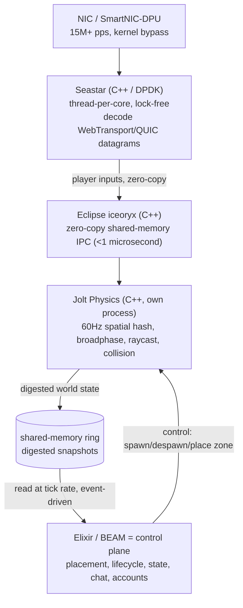

# Data plane boundary

rivet_ex is the **control plane**. It decides *which* node owns a zone, keeps one
writer per id, hands zones off on node loss, and holds durable state. It must
never touch a game packet.

The **data plane** decides *how fast* one node ingests. At MMOG scale the hot path
(datagram ingest, decode, spatial physics) runs outside the BEAM, in C/C++/Rust on
pinned cores or on NIC silicon. This document fixes the boundary between them so
the two halves can be built independently.

## The stack

| Tier | Tech | Owns | Peak |
| --- | --- | --- | --- |
| Network | **Seastar (C++/DPDK)** | Datagram ingest + decode, kernel bypass, thread-per-core | 15M+ pps |
| IPC | **Eclipse iceoryx (C++)** | Zero-copy shared-memory handoff, network → physics | <1 microsecond |
| Game loop | **Jolt Physics (C++, separate process)** | 60Hz spatial hash, broadphase culling, raycast, collision | multi-core |
| Control | **Elixir / BEAM (rivet_ex)** | Placement, single-writer, failover, durable state, chat, accounts, matchmaking | — |

## The three contracts across the boundary

1. **Network → Physics (iceoryx, zero-copy).** Seastar decodes datagrams and
   publishes decrypted player inputs into an iceoryx pool; Jolt subscribes. Pure
   shared memory, no copy, sub-microsecond. rivet_ex is not involved.

2. **Physics → BEAM (shared-memory ring, read at tick rate).** Jolt writes
   *digested* world state (not packets) into a shared-memory ring. BEAM reads the
   latest snapshot at its tick rate through a thin **dirty NIF** or a **C-Node /
   Port**. The BEAM side is **event-driven or tick-scheduled, never a busy-poll**.

3. **BEAM → Data plane (control channel).** rivet_ex issues lifecycle commands:
   spawn a zone's data-plane worker on this node, despawn it, migrate it. These
   ride a Port/NIF control path, low-rate, request/response.

## Hard rules

- **No game packets in the BEAM.** Ever. Even at 500k pps the BEAM is the wrong
  packet pump (per-message copy, GC, preemptive scheduling). The 15M figure is the
  extreme tail; the BEAM should leave the hot path two orders of magnitude earlier.
- **Never busy-poll inside a NIF.** A long-running NIF blocks a scheduler thread
  and wrecks whole-VM latency. The data plane owns the busy-poll on pinned cores in
  a *separate OS process*; the BEAM reads pre-assembled state off a ring via a
  dirty NIF / Port at tick rate.
- **Data plane owns pinned cores.** DPDK/Seastar reactor cores run at 100%
  permanently and are excluded from the BEAM scheduler set.
- **Interest management before hardware.** A server only faces 15M pps if it is
  *interested* in 15M pps. Spatial sharding + area-of-interest culling (one zone =
  one actor, placed on one node) keeps per-server pps bounded. Reach for AF_XDP →
  DPDK → SmartNIC only for a single zone that cannot be sharded further.

## The pps escalation ladder

Climb only when the tier below is genuinely saturated, and cull first.

1. **OS UDP sockets** — fine to ~100k–500k pps. Default.
2. **AF_XDP** — ~5–10M pps, some kernel involvement, no special NIC.
3. **DPDK / Seastar** — 15–30M pps, dedicate 4–8 cores to polling.
4. **SmartNIC / DPU** — 50–100M+ pps, offload decode/filter onto NIC silicon.

## Where rivet_ex fits

rivet_ex decides *where* a zone runs; the data plane decides *how fast* that one
server ingests. They compose through placement:

- `Horde` single-writer + handoff (already built) tells the data plane **which box
  owns a zone's socket**. When a node dies, rivet_ex re-places the zone; the new
  owner's data-plane worker binds the socket.
- The FoundationDB store (already built) holds the zone's durable state so the new
  owner can resume it after handoff — no filesystem affinity.
- The zone's hot loop (Seastar/iceoryx/Jolt) is spawned and reaped by rivet_ex as
  part of that zone's lifecycle, but runs entirely outside the BEAM.

The next step is a thin, honest prototype of contract (2) and (3): a `RivetEx.Zone`
whose control/durable state lives in the BEAM, with a stubbed data-plane worker
behind a behaviour, so the seam is exercised before the C++ exists. See
`RivetEx.DataPlane`.
