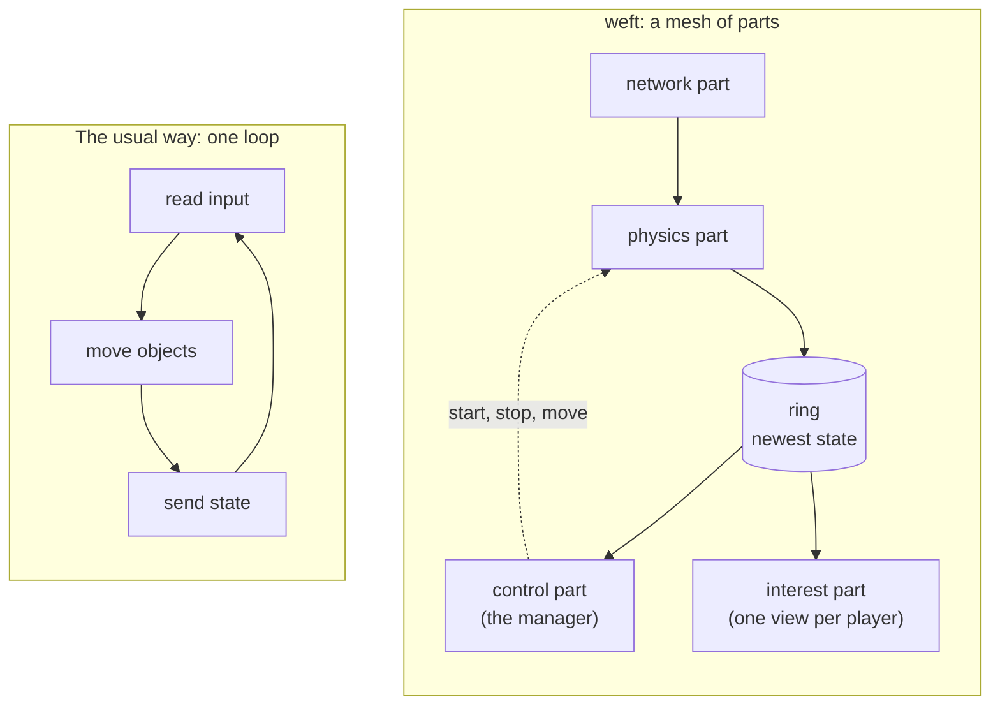

# How weft works

If you have seen a screenshot of weft and had no idea what you were looking at, this
page is for you. You need to know nothing about Elixir, and nothing about game engines.

Read this first, then `Weft` for the full architecture.

## What weft does

weft runs one shared 3D world. Many people join that world at the same time. Each
person controls an avatar. Each person sees the other people move.

The hard part is not drawing the world. It is that everyone has to see roughly the same
world at roughly the same moment, and "roughly" has to be measured in milliseconds. When
you move your hand, everyone else should see it move now, not a beat later. Every choice
below is downstream of that.

How many people fit in one world? We do not know. Nobody has tested it. There is a
section at the end called "What we have not proven", and it is worth reading before you
quote any number from this page.

## The usual way: one main loop

Most game servers run one main loop. The loop repeats about 60 times each second. Each
turn of the loop does three steps:

1. Read the input from every player.
2. Move every object in the world.
3. Send the new state to every player.

For a small world this is exactly right, and it is what almost everything does. It has
three problems, and they all show up at the same time — when the world gets busy.

- **One loop uses one core.** More players make each turn longer, so the world slows
  down precisely when it is most popular.
- **Every step waits for the slowest step.** A slow physics step delays the network
  step, even though the two have nothing to do with each other.
- **One fault stops everything.** A crash anywhere in the loop stops the whole world.

## The new way: the loop becomes a mesh

So weft turns the loop inside out. Each step of it becomes a separate program with its
own cores, running at its own speed. Together they are the **mesh**.

Nothing waits for a turn of the loop, because there is no loop to take a turn in. Each
part reads the newest data it can find, does its job, and writes the result. Nobody is
in charge of the tempo.

## The parts

Each part below is a separate program on the machine. weft calls each one a **plane**.

**The control plane.** This is the manager, and it is the Elixir program named weft. It
decides which machine owns which part of the world. It starts a part, stops a part, and
moves a part after a fault. It remembers who owns what. It is fast at decisions and slow
at heavy work, so it never touches a game packet.

**The game data plane.** This part does the heavy work. It reads the network, decodes
the movement messages, and runs the physics. It is C++ code, and it runs on its own
cores.

**The store plane.** This part remembers the world. It writes to a fast local file
first. It copies to a shared database later, and to cold storage after that. The slow
copies never delay a write.

**The interest plane.** This part builds one view for each player. A player only needs
to see the world near them. This part culls the rest and sends the small result.

## The ring: how the parts share state

The parts do not send messages to each other on the hot path. A message costs a copy,
and a copy costs time.

Instead the parts share one small piece of memory, called the **ring**. The physics part
writes the newest world state into the ring. It overwrites the old state each time. The
control part reads whatever is in the ring at that moment.

Which sounds careless. If the writer overwrites the slot while a reader is behind, that
reader misses updates entirely.

That turns out to be the right behaviour, not a defect. Think about what a missed update
actually is: somebody's position from three frames ago. Nobody wants it. Delivering it
reliably would be work spent moving data that is already wrong. A reader that falls
behind should skip to the newest state, which is exactly what this does — and because
nobody ever waits for anybody, it is also much faster.

## An example: one hand movement

Follow one movement through the mesh. You wear a headset and you move your hand.

1. Your headset measures the new hand position.
2. Your client sends a small message, about 24 bytes, over the network.
3. The game data plane reads the message and decodes it. This step is measured in
   nanoseconds.
4. The physics part applies the movement to your avatar and writes the result in the ring.
5. The interest plane reads the ring. It finds the players near you.
6. The interest plane sends your new hand position to those players only.
7. Their clients draw your hand.

The control plane does not appear in these steps. It set the mesh up before you moved,
and it watches for faults. It stays out of the fast path.

## Why the parts are separate programs

A part can fail. A part can parse a bad file, or hit a bug in a large library, and
crash. weft keeps each part in its own program for two reasons.

- **A crash stays local.** One part crashes and restarts on its own. The world keeps
  running.
- **A part cannot reach what it does not need.** Each part runs in a sandbox. A plane has
  no network access. Only an edge has network access, and an edge does no other work.

## Does the mesh actually go faster

Yes, and by a margin wide enough that the interesting question changes.

Applying one movement message takes nanoseconds. Even the pessimistic measurement, where
the entities are scattered over two gigabytes and every write misses the cache, leaves one
core clearing the target several times over. The figures, and the machine they came from,
are in `../logbook/data_plane.md`.

The number that matters most is the cheapest one: reading the ring costs microseconds, so
sampling it sixty times a second costs almost nothing. The manager stays free for
decisions.

The work is not the limit. Moving the bytes in and out of the machine is the limit. So
the heavy parts sit close to the network card. The manager stays away from the packets.

## What we have not proven

Be careful with this page. It describes a design and some measured parts. It does not
describe a finished system. Do not quote a player count from it.

**We have never run this with real players.** Not 1000 people. Not 100 people. Not one
person in a headset. The client is not built yet. The number of people one world can
hold is an open question, and `../reference/vr_acceptance_proof.md` records it as
unstarted work.

**The measured numbers test parts, not the whole.** They come from one developer
machine. They show that the physics work and the ring are fast enough. They do not show
that the whole mesh holds together under a real load.

**Some parts of the mesh are not built yet.** The store plane and the asset baker still
run as prototypes, not as native planes. The interest plane is a design. The shared bus
that all of them will use passes a message between two processes and nothing more, which
is a foundation rather than a part.

**One number is real, and it is a real workload.** weft replays a traffic simulation of
11,947 vehicles, with 8,637 of them moving at the same time. Each vehicle is an entity,
the same as an avatar. That load is real movement, and the mesh handles it. Vehicles
are not players, so this does not answer the player question.

So: the parts are fast, and the shape of the design holds up on a real workload. The
system is early. The task pages in `../reference/` list what remains.

## Words you will see

| Word          | Meaning                                                                  |
| ------------- | ------------------------------------------------------------------------ |
| plane         | One part of the mesh. One program with one job. It has no network.       |
| edge          | A plane with networking. It decodes the network and gives the result on. |
| control plane | The manager. The Elixir program named weft.                              |
| zone          | One region of the world. It simulates the things inside it.              |
| entity        | One thing in the world with a position, such as an avatar or a vehicle.  |
| authority     | The one part that may change an entity. Exactly one part per entity.     |
| interest      | A read-only copy of the world near a player.                             |
| ring          | The shared memory slot that holds the newest state.                      |
| iceoryx       | The method the parts use to share memory on one machine.                 |
| FoundationDB  | The shared database that remembers state across machines.                |

## Read more

- `Weft` is the full architecture and the plane rules.
- `Weft.DataPlane` is the boundary between the manager and the heavy parts.
- `latency.md` explains why each choice keeps latency low.
- `Weft.Actor.Store` explains how weft remembers the world.
- `benchmarks.md` says what the measurements changed our minds about. The numbers are in
  the logbooks under `../reference/`, one for each plane.
