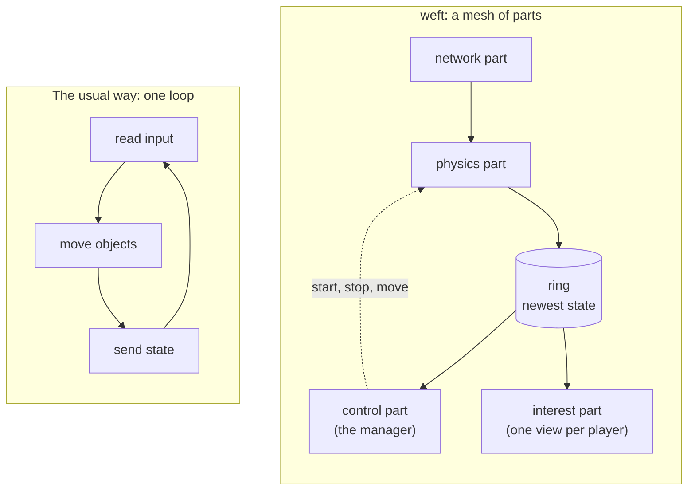

# How weft works

This page explains weft to a new reader. It uses simple words and no jargon. Read this
page first. Then read `planes.md` for the full architecture.

You do not need to know Elixir. You do not need to know game engines.

## What weft does

weft runs one shared 3D world. Many people join that world at the same time. Each
person controls an avatar. Each person sees the other people move.

Low latency is the first rule. When you move your hand, the other people must see it
almost at once. A slow world makes a headset user sick. So every design choice below
protects latency first.

How many people can join one world? We do not know yet. Read "What we have not proven"
at the end of this page before you quote a number.

## The usual way: one main loop

Most game servers run one main loop. The loop repeats about 60 times each second. Each
turn of the loop does three steps:

1. Read the input from every player.
2. Move every object in the world.
3. Send the new state to every player.

This design is simple, and it works well for a small world. It has three limits.

- **One loop uses one core.** More players make each turn longer. The world slows down.
- **Every step waits for the slowest step.** A slow physics step delays the network step.
- **One fault stops everything.** A crash in any step stops the whole world.

## The new way: the loop becomes a mesh

weft cuts the main loop into parts. Each part becomes its own program. Each program
does one job, keeps its own cores, and runs at its own speed. The parts together are
the **mesh**.

Nothing waits for a turn of one loop. Each part reads the newest data it can find, does
its job, and writes the result. This is the inversion: the loop becomes a mesh.

## The parts

Each part below is a separate program on the machine. weft calls each one a **plane**.

**The control plane.** This is the manager, and it is the Elixir program named weft. It
decides which machine owns which part of the world. It starts a part, stops a part, and
moves a part after a fault. It remembers who owns what. It is fast at decisions and slow
at heavy work, so it never touches a game packet.

**The game data plane.** This part does the heavy work. It reads the network, decodes
the movement messages, and runs the physics. It is C++ code, and it runs on its own
cores.

**The store plane.** This part remembers the world. It writes to a fast local file
first. It copies to a shared database later, and to cold storage after that. The slow
copies never delay a write.

**The interest plane.** This part builds one view for each player. A player only needs
to see the world near them. This part culls the rest and sends the small result.

## The ring: how the parts share state

The parts do not send messages to each other on the hot path. A message costs a copy,
and a copy costs time.

Instead the parts share one small piece of memory, called the **ring**. The physics part
writes the newest world state into the ring. It overwrites the old state each time. The
control part reads whatever is in the ring at that moment.

This has one useful property. A reader never waits for a writer, and a writer never
waits for a reader. A reader that falls behind does not slow the writer down. It simply
reads the next newest state. In a live world the newest state is the only state that
matters. Old positions have no value.

## An example: one hand movement

Follow one movement through the mesh. You wear a headset and you move your hand.

1. Your headset measures the new hand position.
2. Your client sends a small message, about 24 bytes, over the network.
3. The game data plane reads the message and decodes it. This step is measured in
   nanoseconds.
4. The physics part applies the movement to your avatar and writes the result in the ring.
5. The interest plane reads the ring. It finds the players near you.
6. The interest plane sends your new hand position to those players only.
7. Their clients draw your hand.

The control plane does not appear in these steps. It set the mesh up before you moved,
and it watches for faults. It stays out of the fast path.

## Why the parts are separate programs

A part can fail. A part can parse a bad file, or hit a bug in a large library, and
crash. weft keeps each part in its own program for two reasons.

- **A crash stays local.** One part crashes and restarts on its own. The world keeps
  running.
- **A part cannot reach what it does not need.** Each part runs in a sandbox. Most parts
  have no network access at all.

## Does the mesh actually go faster

Yes. These numbers come from `benchmarks.md`, measured on one developer machine.

| Question                                              | Answer                   | Note            |
| ----------------------------------------------------- | ------------------------ | --------------- |
| How long does one movement message take to apply?     | 1.2 nanoseconds          | Data in cache   |
| The same, with the data spread over 2 GB of memory?   | 24 nanoseconds           | The honest case |
| How many can one core apply each second?              | 41 million               | The honest case |
| How many does the target need?                        | 15 million               |                 |
| How many world updates reach the manager each second? | 27.7 million on 16 cores |                 |
| How much does the ring cost to read?                  | About 3 microseconds     |                 |

The last row matters most. Reading the ring 60 times each second costs almost nothing.
The manager stays free for decisions.

The work is not the limit. Moving the bytes in and out of the machine is the limit. So
the heavy parts sit close to the network card. The manager stays away from the packets.

## What we have not proven

Be careful with this page. It describes a design and some measured parts. It does not
describe a finished system. Do not quote a player count from it.

**We have never run this with real players.** Not 1000 people. Not 100 people. Not one
person in a headset. The client is not built yet. The number of people one world can
hold is an open question, and `tasks.md` records it as unstarted work.

**The measured numbers test parts, not the whole.** They come from one developer
machine. They show that the physics work and the ring are fast enough. They do not show
that the whole mesh holds together under a real load.

**Some parts of the mesh are not built yet.** The store plane and the asset baker still
run as prototypes, not as native planes. The interest plane is a design.

**One number is real, and it is a real workload.** weft replays a traffic simulation of
11,947 vehicles, with 8,637 of them moving at the same time. Each vehicle is an entity,
the same as an avatar. That load is real movement, and the mesh handles it. Vehicles
are not players, so this does not answer the player question.

So: the parts are fast, and the shape of the design holds up on a real workload. The
system is early. `tasks.md` lists what remains.

## Words you will see

| Word          | Meaning                                                                 |
| ------------- | ----------------------------------------------------------------------- |
| plane         | One part of the mesh. One program with one job.                         |
| control plane | The manager. The Elixir program named weft.                             |
| zone          | One region of the world. It simulates the things inside it.             |
| entity        | One thing in the world with a position, such as an avatar or a vehicle. |
| authority     | The one part that may change an entity. Exactly one part per entity.    |
| interest      | A read-only copy of the world near a player.                            |
| ring          | The shared memory slot that holds the newest state.                     |
| iceoryx       | The method the parts use to share memory on one machine.                |
| FoundationDB  | The shared database that remembers state across machines.               |

## Read more

- `planes.md` is the full architecture and the plane rules.
- `data-plane.md` is the boundary between the manager and the heavy parts.
- `latency.md` explains why each choice keeps latency low.
- `store.md` explains how weft remembers the world.
- `benchmarks.md` holds the measured numbers.
